# Training Pipeline - Chatbot AIMS (Qwen3 Fine-Tuning)

Dokumentasi lengkap proses fine-tuning model Qwen3 untuk Chatbot AIMS
(Sistem Informasi Cuaca & Kebencanaan Indonesia).

---

## Daftar Isi

1. [Arsitektur Umum](#1-arsitektur-umum)
2. [Alur Data Training](#2-alur-data-training)
3. [Sumber Data Training (6 Sumber)](#3-sumber-data-training-6-sumber)
4. [Pipeline Steps (run_training.sh)](#4-pipeline-steps)
5. [Detail Setiap Script](#5-detail-setiap-script)
6. [Tabel Database yang Dicakup (27 Tabel)](#6-tabel-database-yang-dicakup)
7. [Konfigurasi & Mode](#7-konfigurasi--mode)
8. [Cara Menjalankan](#8-cara-menjalankan)

---

## 1. Arsitektur Umum

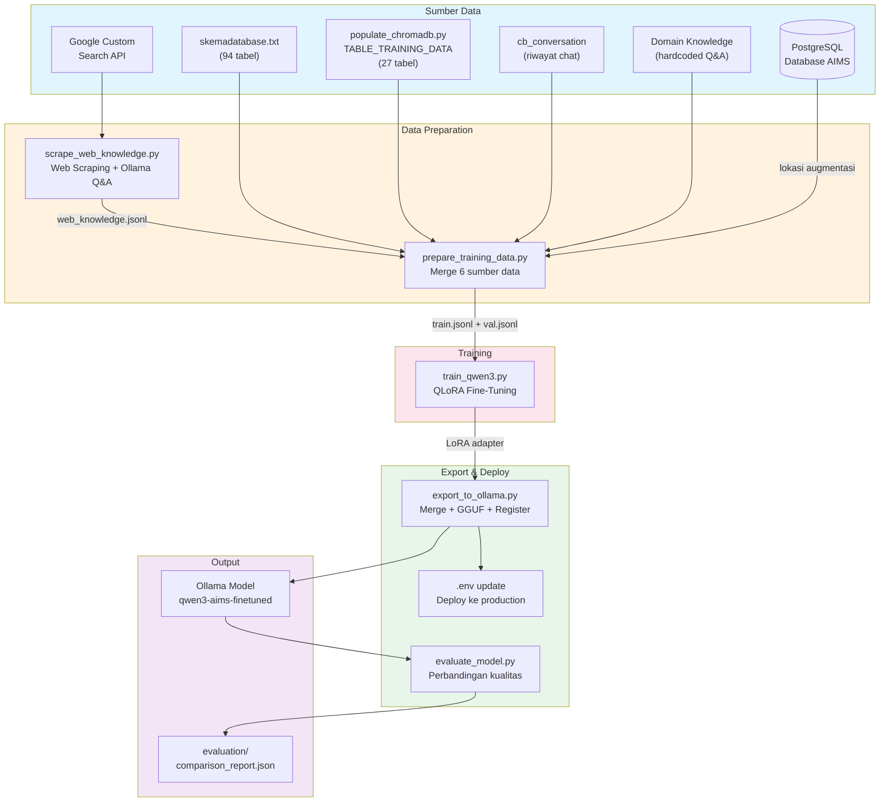

---

## 2. Alur Data Training

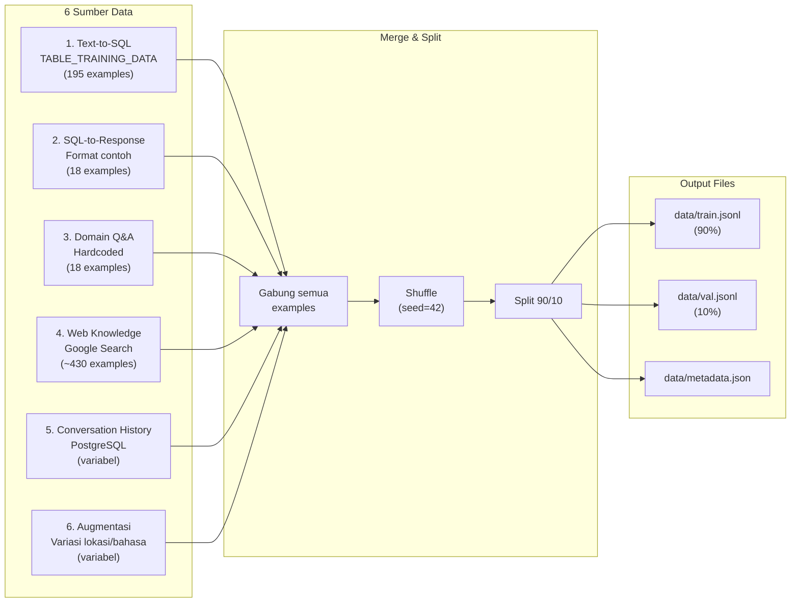

---

## 3. Sumber Data Training (6 Sumber)

### 3.1 Text-to-SQL Examples

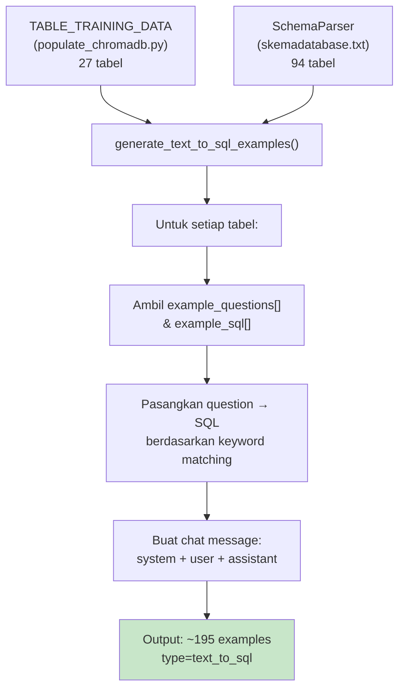

**Format output:**
```json
{
  "messages": [
    {"role": "system", "content": "Kamu adalah asisten AI ... [schema tabel]"},
    {"role": "user", "content": "Ada berapa hotspot di Kalimantan hari ini?"},
    {"role": "assistant", "content": "SELECT date_hotspot, nama_provinsi ... FROM indo_hotspot ..."}
  ],
  "type": "text_to_sql",
  "table": "indo_hotspot"
}
```

### 3.2 SQL-to-Response Format Examples

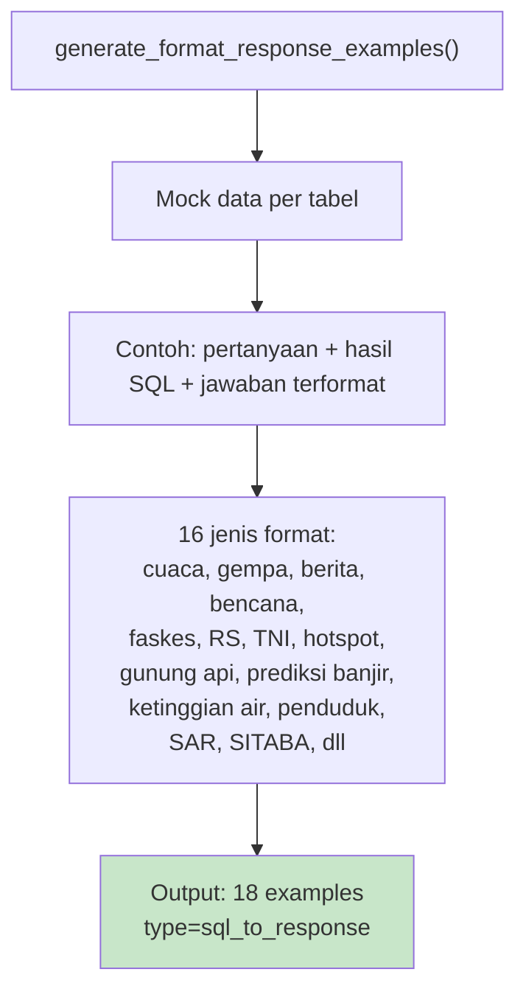

**Format output:**
```json
{
  "messages": [
    {"role": "system", "content": "Kamu adalah asisten AI. Format jawaban dari hasil query..."},
    {"role": "user", "content": "Pertanyaan: ...\n\nHasil Query:\n[{...}]"},
    {"role": "assistant", "content": "Berikut data ...\n\n**1. ...**\n- Detail: ..."}
  ],
  "type": "sql_to_response",
  "table": "bmkg_info_cuaca"
}
```

### 3.3 Domain Q&A (Hardcoded)

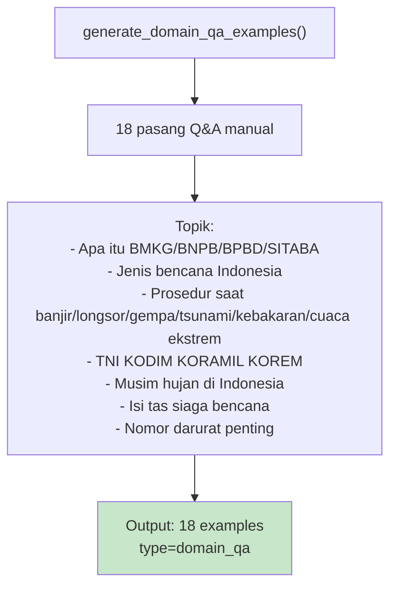

### 3.4 Web Knowledge (Google Search + Ollama)

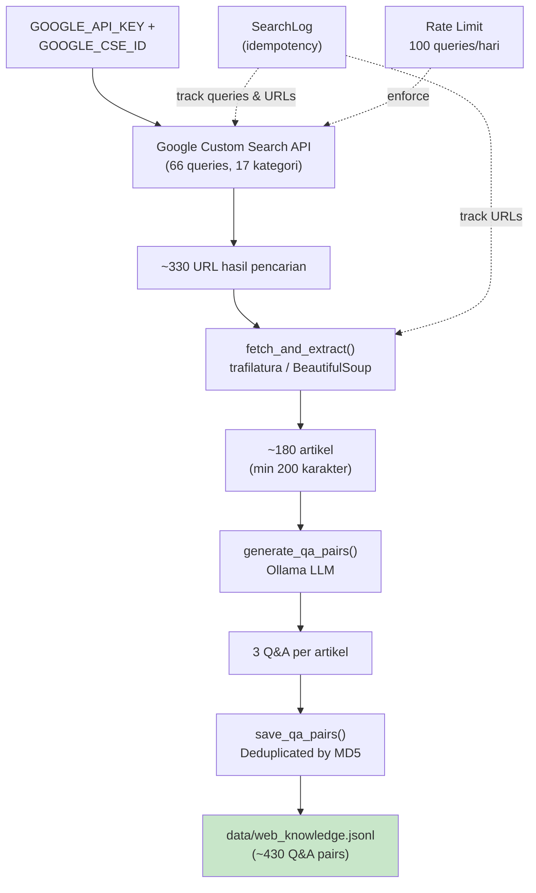

**17 Kategori Pencarian:**

| No | Kategori | Queries | Contoh |
|----|----------|---------|--------|
| 1 | cuaca | 7 | prakiraan cuaca BMKG, El Nino La Nina |
| 2 | gempa | 7 | gempa bumi BMKG, Ring of Fire |
| 3 | bencana | 6 | BNPB fungsi, mitigasi bencana |
| 4 | banjir | 4 | prosedur evakuasi banjir |
| 5 | longsor | 4 | tanda-tanda longsor |
| 6 | kebakaran | 4 | karhutla, kabut asap |
| 7 | tsunami | 4 | peringatan dini tsunami |
| 8 | tni_response | 3 | TNI bantuan bencana |
| 9 | fasilitas_kesehatan | 4 | puskesmas, RS rujukan |
| 10 | kesiapsiagaan | 4 | tas siaga, nomor darurat |
| 11 | gunung_api | 4 | PVMBG, MAGMA Indonesia |
| 12 | hotspot_karhutla | 3 | satelit MODIS VIIRS |
| 13 | prediksi_bencana | 3 | early warning, ketinggian air |
| 14 | sar_basarnas | 2 | BASARNAS, prosedur SAR |
| 15 | kesehatan_bencana | 2 | penyakit pasca bencana |
| 16 | kependudukan | 2 | BPS sensus penduduk |
| 17 | general | 3 | geografi, klimatologi |

### 3.5 Conversation History

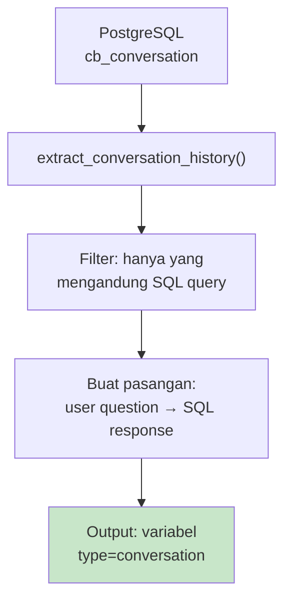

### 3.6 Augmentasi (Variasi Lokasi & Bahasa)

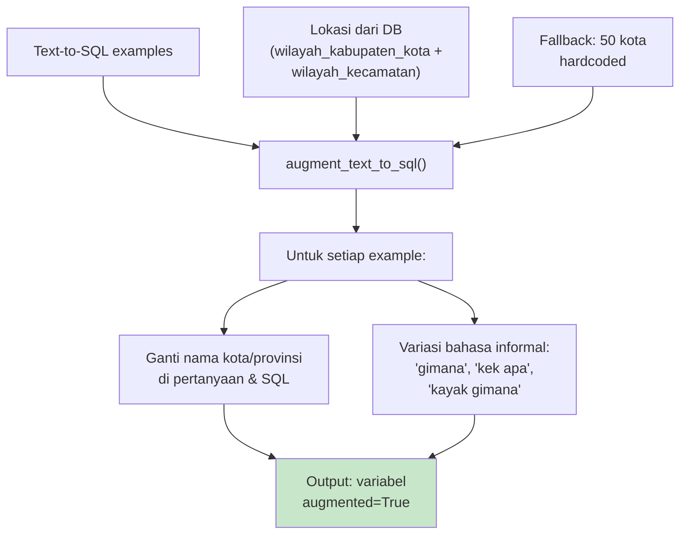

---

## 4. Pipeline Steps

### Full Training (6 Steps)

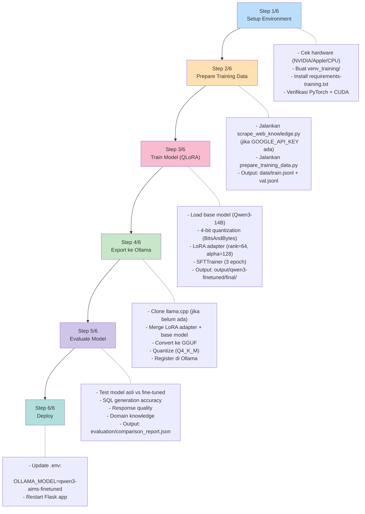

### Local Test (3 Steps - MacBook)

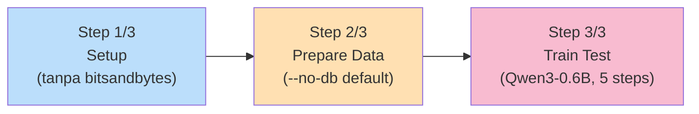

---

## 5. Detail Setiap Script

### 5.1 `scripts/prepare_training_data.py`

Orchestrator utama yang menggabungkan 6 sumber data.

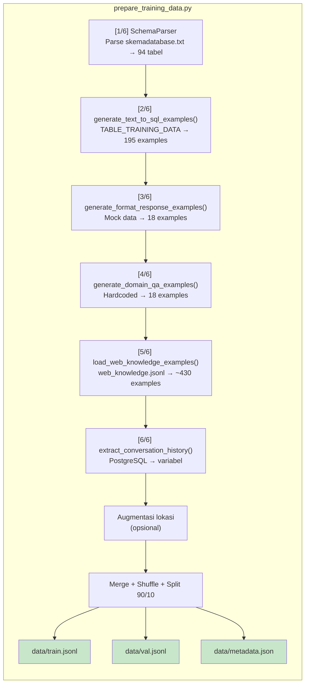

**Fungsi-fungsi utama:**

| Fungsi | Baris | Deskripsi |
|--------|-------|-----------|
| `_load_training_data()` | 40 | Load TABLE_TRAINING_DATA dari populate_chromadb.py via AST parsing |
| `load_locations_from_db()` | 168 | Ambil lokasi dari wilayah_kabupaten_kota + wilayah_kecamatan |
| `SchemaParser` | 252 | Parse skemadatabase.txt, generate condensed schema per tabel |
| `build_system_prompt_sql()` | 445 | System prompt untuk Text-to-SQL |
| `build_system_prompt_format()` | 464 | System prompt untuk SQL-to-Response |
| `build_system_prompt_domain()` | 478 | System prompt untuk Domain Q&A |
| `generate_text_to_sql_examples()` | 484 | Sumber 1: Text → SQL |
| `generate_format_response_examples()` | 566 | Sumber 2: SQL result → formatted response |
| `generate_domain_qa_examples()` | 1179 | Sumber 3: Domain knowledge Q&A |
| `load_web_knowledge_examples()` | 1260 | Sumber 4: Web knowledge dari JSONL |
| `extract_conversation_history()` | 1321 | Sumber 5: Riwayat percakapan |
| `augment_text_to_sql()` | 1414 | Sumber 6: Augmentasi variasi |
| `build_dataset()` | 1574 | Main orchestrator |

### 5.2 `scripts/scrape_web_knowledge.py`

Web scraper yang mengumpulkan knowledge dari internet.

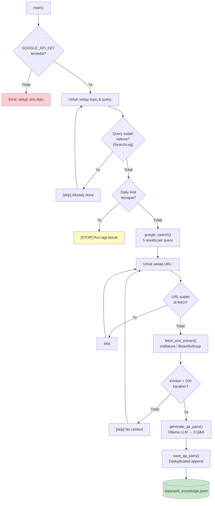

**Komponen utama:**

| Komponen | Deskripsi |
|----------|-----------|
| `SearchLog` | Idempotency tracker - simpan query & URL yang sudah diproses |
| `google_search()` | Google Custom Search API (lr=lang_id, gl=id) |
| `fetch_and_extract()` | Extract konten artikel (trafilatura primary, BeautifulSoup fallback) |
| `generate_qa_pairs()` | Ollama LLM generate 3 Q&A per artikel |
| `save_qa_pairs()` | Append ke JSONL dengan dedup by MD5 hash |

### 5.3 `scripts/train_qwen3.py`

Fine-tuning model dengan QLoRA.

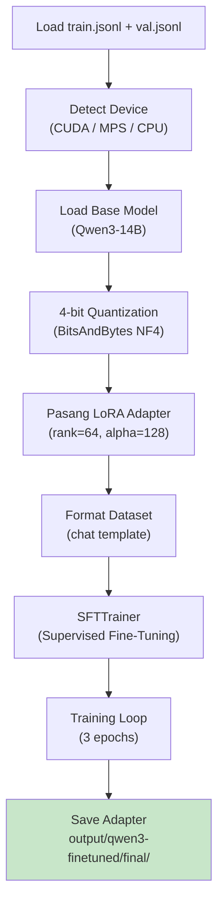

**Parameter default vs H100:**

| Parameter | Default | H100 | Local Test |
|-----------|---------|------|------------|
| Model | Qwen3-14B | Qwen3-14B | Qwen3-0.6B |
| Batch size | 4 | 8 | 1 |
| LoRA rank | 64 | 128 | 8 |
| LoRA alpha | 128 | 256 | 16 |
| Epochs | 3 | 3 | 1 |
| Max seq len | 2048 | 2048 | 512 |
| Max steps | - | - | 5 |
| TF32 | off | on | off |

### 5.4 `scripts/export_to_ollama.py`

Konversi model ke format Ollama.

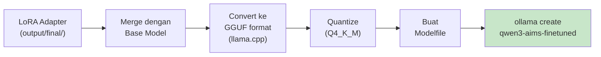

### 5.5 `scripts/evaluate_model.py`

Evaluasi perbandingan model asli vs fine-tuned.

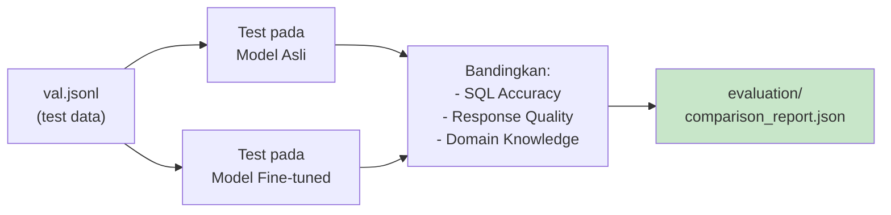

---

## 6. Tabel Database yang Dicakup

### 27 Tabel dalam TABLE_TRAINING_DATA

```mermaid
graph TB
    subgraph cuaca["Cuaca & Klimatologi"]
        T1["bmkg_info_cuaca<br/>(prakiraan cuaca)"]
    end

    subgraph gempa["Gempa & Seismologi"]
        T2["bmkg_info_gempa<br/>(data gempa)"]
    end

    subgraph bencana["Laporan Bencana"]
        T4["laporan_bencana_harian<br/>(laporan harian)"]
        T5["laporan_bencana_khusus<br/>(laporan detail)"]
        T7["master_kejadian_bencana<br/>(agregat kejadian)"]
        T8["sitaba_bencana<br/>(SITABA records)"]
        T6["bmkg_info_bencana<br/>(peringatan dini)"]
    end

    subgraph gunung["Vulkanologi"]
        T12["indo_hotspot<br/>(titik panas/karhutla)"]
        T13["magma_letusan_gunung<br/>(erupsi)"]
        T14["master_gunung_api<br/>(127 gunung api)"]
    end

    subgraph prediksi["Prediksi & Monitoring"]
        T15["prediksi_banjir<br/>(prediksi per kecamatan)"]
        T16["potensi_banjir<br/>(klasifikasi risiko)"]
        T17["potensi_kebakaran<br/>(klasifikasi risiko)"]
        T24["sitaba_ketinggian_air<br/>(water level)"]
        T22["master_pergerakan_tanah<br/>(ground movement)"]
    end

    subgraph berita["Berita & Informasi"]
        T3["articles<br/>(berita kebencanaan)"]
        T18["bmkg_news<br/>(berita BMKG)"]
        T19["bnpb_news<br/>(berita BNPB)"]
        T25["summ_news_daily<br/>(ringkasan harian)"]
    end

    subgraph responder["Responder & Operasi"]
        T9["tni_satker<br/>(satuan kerja TNI)"]
        T23["master_operasi_sar<br/>(operasi SAR)"]
        T27["master_operasi_bencana<br/>(operasi aktif)"]
        T26["master_rekomendasi_bencana<br/>(rekomendasi)"]
    end

    subgraph faskes["Fasilitas Kesehatan"]
        T10["master_puskesmas<br/>(puskesmas)"]
        T11["master_rs_nasional<br/>(rumah sakit)"]
        T21["master_data_penyakit_wabah<br/>(penyakit/wabah)"]
    end

    subgraph demografi["Demografi"]
        T20["bps_jumlah_penduduk<br/>(data penduduk BPS)"]
    end

    style cuaca fill:#bbdefb
    style gempa fill:#ffcdd2
    style bencana fill:#ffe0b2
    style gunung fill:#d7ccc8
    style prediksi fill:#b2ebf2
    style berita fill:#f0f4c3
    style responder fill:#c8e6c9
    style faskes fill:#f8bbd0
    style demografi fill:#d1c4e9
```

### Cakupan per Jenis Training Data

| Tabel | Text-to-SQL | SQL-to-Response | Web Knowledge |
|-------|:-----------:|:---------------:|:-------------:|
| bmkg_info_cuaca | v | v | v |
| bmkg_info_gempa | v | v | v |
| articles | v | v | - |
| laporan_bencana_harian | v | v | v |
| laporan_bencana_khusus | v | v | - |
| bmkg_info_bencana | v | v | - |
| master_kejadian_bencana | v | v | - |
| sitaba_bencana | v | v | - |
| tni_satker | v | v | v |
| master_puskesmas | v | v | v |
| master_rs_nasional | v | v | v |
| indo_hotspot | v | v | v |
| magma_letusan_gunung | v | v | v |
| master_gunung_api | v | - | v |
| prediksi_banjir | v | v | v |
| potensi_banjir | v | - | v |
| potensi_kebakaran | v | - | v |
| bmkg_news | v | - | - |
| bnpb_news | v | - | - |
| bps_jumlah_penduduk | v | v | v |
| master_data_penyakit_wabah | v | - | v |
| master_pergerakan_tanah | v | - | - |
| master_operasi_sar | v | v | v |
| sitaba_ketinggian_air | v | v | v |
| summ_news_daily | v | - | - |
| master_rekomendasi_bencana | v | - | - |
| master_operasi_bencana | v | - | - |

---

## 7. Konfigurasi & Mode

### Environment Variables (.env)

```
# Database (untuk conversation history & augmentasi lokasi)
POSTGRES_HOST, POSTGRES_PORT, POSTGRES_USER, POSTGRES_PASS, POSTGRES_DB_NAME

# Ollama (untuk Q&A generation di web scraper)
OLLAMA_BASE_URL="https://llm.alindo.id"
OLLAMA_MODEL="qwen3-coder:latest"

# Google Custom Search (untuk web knowledge)
GOOGLE_API_KEY=""
GOOGLE_CSE_ID=""
```

### Mode Training

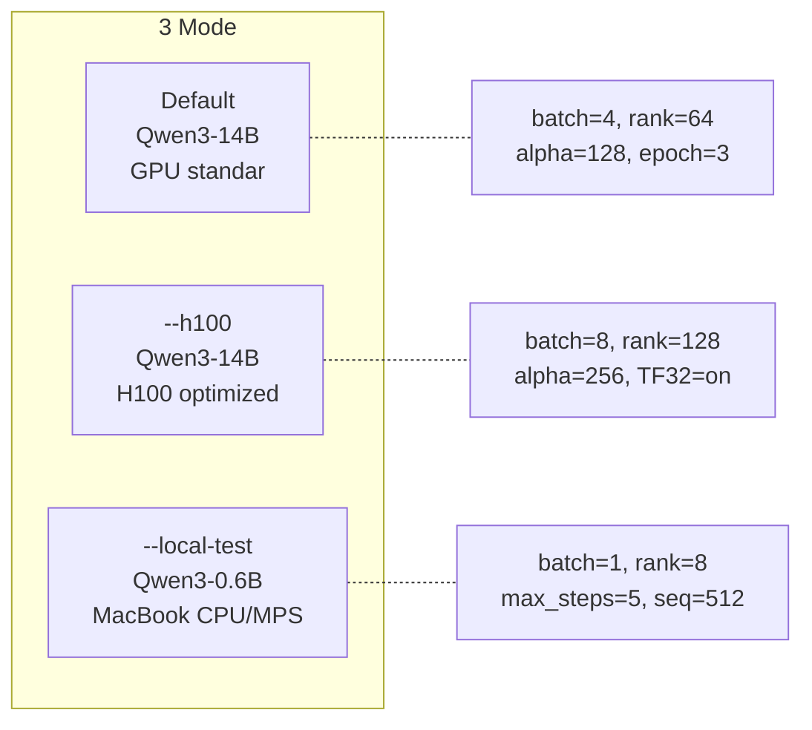

### CLI Flags (run_training.sh)

| Flag | Deskripsi |
|------|-----------|
| `--local-test` | Test pipeline di MacBook (3 steps saja) |
| `--h100` | Preset optimasi untuk NVIDIA H100 80GB |
| `--step N` | Mulai dari step ke-N (1-6) |
| `--model MODEL` | Override HuggingFace model ID |
| `--batch N` | Override batch size |
| `--rank N` | Override LoRA rank |
| `--epochs N` | Override jumlah epoch |
| `--quant TYPE` | Quantization: Q4_K_M, Q5_K_M, Q8_0 |
| `--name NAME` | Nama model di Ollama |
| `--no-db` | Skip ekstraksi database |
| `--skip-web` | Skip web knowledge scraping |
| `--use-unsloth` | Gunakan Unsloth (2x lebih cepat) |

---

## 8. Cara Menjalankan

### Persiapan Awal

```bash
# 1. Setup Google Custom Search (opsional, untuk web knowledge)
#    - https://console.cloud.google.com/ → Enable Custom Search API
#    - https://programmablesearchengine.google.com/ → Buat search engine
#    - Isi GOOGLE_API_KEY dan GOOGLE_CSE_ID di .env

# 2. Test pipeline di MacBook
./run_training.sh --local-test

# 3. Test tanpa database (tanpa PostgreSQL)
./run_training.sh --local-test --no-db
```

### Training Penuh (Server GPU)

```bash
# Default (Qwen3-14B, GPU standar)
./run_training.sh

# H100 80GB (optimized)
./run_training.sh --h100

# GPU kecil (8-16GB VRAM)
./run_training.sh --model Qwen/Qwen3-8B --batch 1

# Skip web scraping
./run_training.sh --skip-web

# Mulai dari step tertentu (misal sudah prepare data)
./run_training.sh --step 3
```

### Script Individual

```bash
# Web scraping saja
python scripts/scrape_web_knowledge.py --dry-run      # Preview
python scripts/scrape_web_knowledge.py                 # Full run
python scripts/scrape_web_knowledge.py --topic cuaca   # Satu kategori

# Prepare data saja
python scripts/prepare_training_data.py --no-db --no-web --no-augment

# Evaluasi saja
python scripts/evaluate_model.py --finetuned_model qwen3-aims-finetuned
```

---

## Struktur File

```
chatbot/
├── .env                              # Environment variables
├── run_training.sh                   # Main pipeline orchestrator
├── requirements-training.txt         # Python dependencies
├── skemadatabase.txt                 # Database schema (94 tabel)
│
├── scripts/
│   ├── populate_chromadb.py          # TABLE_TRAINING_DATA (27 tabel) + ChromaDB
│   ├── prepare_training_data.py      # Data preparation (6 sumber → JSONL)
│   ├── scrape_web_knowledge.py       # Google Search → Q&A via Ollama
│   ├── train_qwen3.py               # QLoRA fine-tuning
│   ├── export_to_ollama.py           # Merge + GGUF + Ollama register
│   └── evaluate_model.py            # Model comparison evaluation
│
├── data/                             # (gitignored)
│   ├── train.jsonl                   # Training dataset
│   ├── val.jsonl                     # Validation dataset
│   ├── metadata.json                 # Dataset statistics
│   ├── web_knowledge.jsonl           # Web-scraped Q&A pairs
│   ├── web_cache/                    # Cached web pages
│   └── web_search_log.json           # Idempotency log
│
├── output/                           # (gitignored)
│   ├── qwen3-finetuned/
│   │   └── final/                    # LoRA adapter weights
│   ├── qwen3-finetuned-q4_k_m.gguf  # Quantized model
│   └── logs/                         # Training & pipeline logs
│
└── evaluation/                       # (gitignored)
    └── comparison_report.json        # Evaluation results
```
